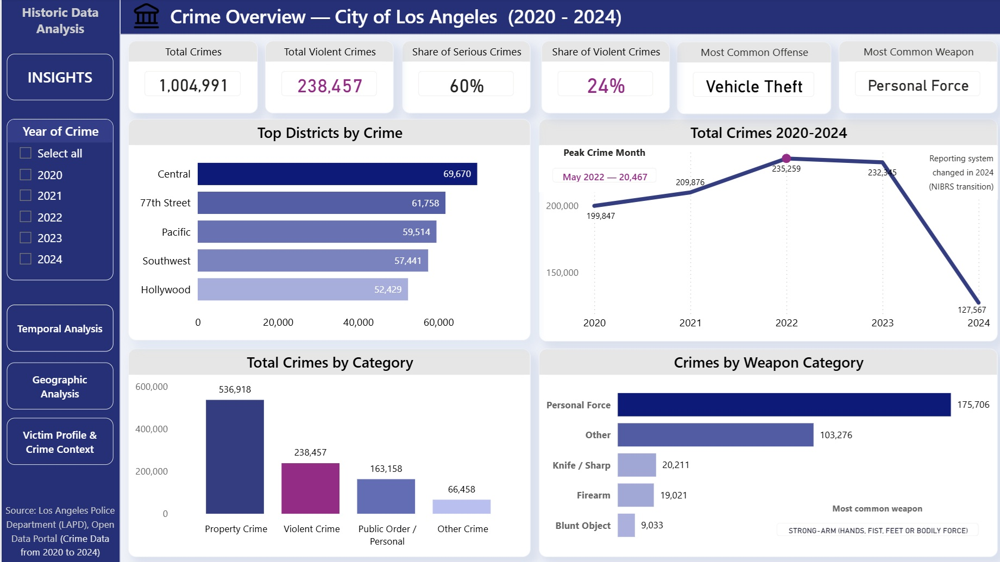
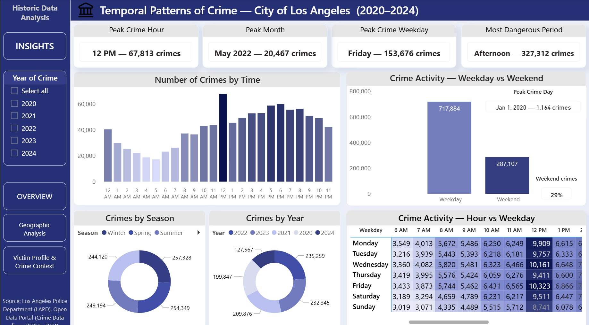
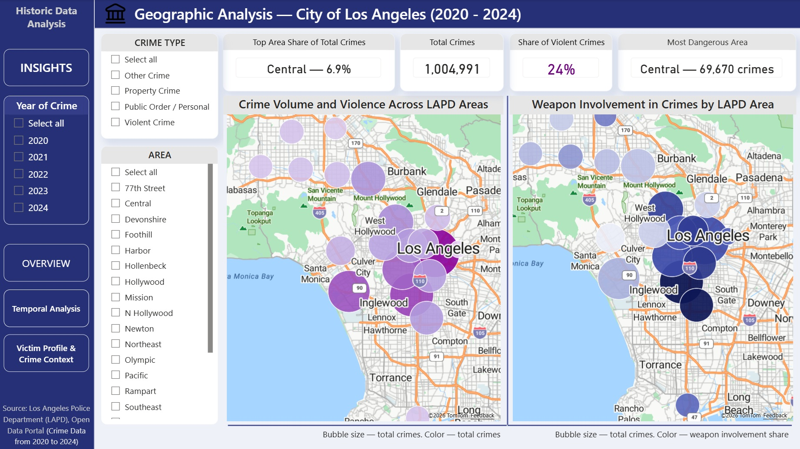
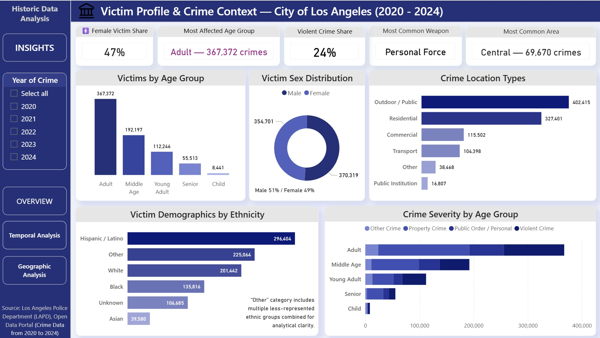

# Los Angeles Crime Analysis Dashboard (2020–2024)

This project presents an end-to-end analytical dashboard exploring crime patterns in the City of Los Angeles using official LAPD open data. The report focuses on temporal trends, geographic distribution, crime characteristics, and victim demographics to uncover meaningful insights about when, where, and how crimes occur.
- Tool: Power BI
- Period: 2020–2024
- Location: Los Angeles, California
________________________________________

## Data Source

- Los Angeles Police Department (LAPD) — Open Data Portal
- Crime Data from 2020 to 2024
- The dataset contains detailed records of reported incidents, including date and time, location, crime type, victim information, and weapon usage.
- Note: In October 2024, LAPD migrated from UCR to the NIBRS reporting system.
The legacy dataset used in this analysis is no longer updated and is maintained only for historical purposes.
Because newer records follow a different reporting standard and remain incomplete, 2025 data were excluded.
- Link to full report: https://app.powerbi.com/view?r=eyJrIjoiOTYzZDUyOGQtMDExMS00MzNiLWI4N2MtMDA1YjA3MjgyYzY1IiwidCI6IjY1NWVhZjVhLTBhMTctNDEzOS05NzU5LTFlMDIzMTRkMDJhYiIsImMiOjZ9
________________________________________

## Key Analytical Areas

 ### Crime Overview
 
- Total crime volume across years
- Most common crime types
- Distribution across city areas
- Long-term trends

### Temporal Patterns

- Crime distribution by hour of day
- Weekday vs weekend behavior
- Seasonal variation
- Identification of peak crime periods
- 💡 Fun (and slightly alarming) finding:
Friday around lunchtime appears to be one of the riskiest times in LA.
So if you live there… maybe grab lunch indoors 😅
________________________________________

### Geographic Analysis

- Crime hotspots across LAPD areas
- Spatial concentration of incidents
- Neighborhood-level differences
________________________________________

###  Victim & Crime Characteristics

- Victim age and gender distribution
- Ethnicity patterns
- Crime severity (violent vs property)
- Weapon involvement
- Location types where crimes occur
- Adults represent the largest victim group, and crimes most frequently occur in public outdoor environments.
________________________________________

### Notable Insights

- Property crimes dominate overall incident counts.
- Violent crimes account for roughly one quarter of reported cases.
- Personal force is the most commonly used “weapon,” indicating many incidents involve direct physical contact rather than firearms.
- Outdoor/public spaces show the highest exposure to crime.
- Victim demographics broadly reflect the city’s diverse population.
- Identity theft and other non-contact offenses highlight the growing role of non-traditional crime types.
- And yes — statistically speaking, Friday lunch plans in LA carry unexpected risk levels.
Consider it data-driven life advice 😄
________________________________________

###  Analytical Approach

The dashboard was built using a structured BI workflow:
-	Data cleaning and transformation
-	Calendar table for time intelligence
-	Derived metrics and DAX measures
-	Categorization of crimes (violent vs property)
-	Aggregation of demographic groups
-	Interactive filtering across all visuals
________________________________________
### Purpose

This project demonstrates the ability to:
- Transform raw public data into analytical insights
- Design business-ready dashboards
- Apply data modeling and DAX
- Communicate findings through clear visual storytelling
________________________________________

## Key dashboards

Crime Overview — City of Los Angeles  (2020 - 2024)

Temporal Patterns of Crime — City of Los Angeles  (2020–2024)

Geographic Analysis — City of Los Angeles (2020 - 2024)

Victim Profile & Crime Context — City of Los Angeles (2020 - 2024)

